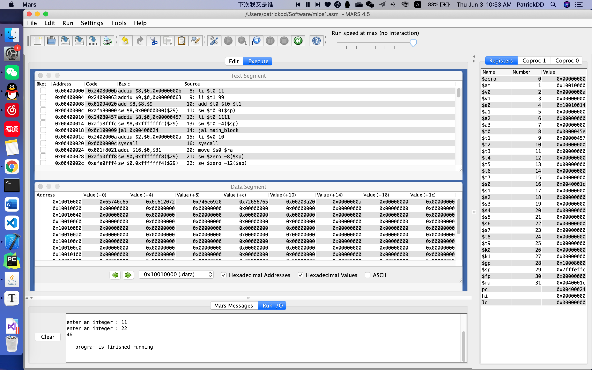

# CompilerProject4 : Code Generator


#### Testing Code (C)

```c
int a = 11+99;
int i=1111;

int main(){
    
    //int a = 9900-i*2/3;
    int x,y;
    get(x,y);
    
    // step into another scope
    if(a <= 998){
        int b = a;
    }
    else if(a==10000){
        a = a - 1;
    }
    else if(a==10001){
        a = a - 2;
    }
    else{
         a = a + 1;
    }
    
    
    if(a==100){
         a = 200;
    }
    
    int b = 12;
    
    while(b<13){
        b = b + 1;
    }
    put(x+y+b);
    
    return 7+i;
}


```


#### Intermediate Code 

```html
( 4, NONE, NONE, main)
( 1, 11, NONE, temp0)
( 1, 99, NONE, temp1)
( 24, temp0, temp1, temp2)
( 3, temp2, NONE, a_2)
( 1, 1111, NONE, temp3)
( 3, temp3, NONE, i_2)
( 6, NONE, NONE, main_block)
( 7, NONE, NONE, NONE)
( 4, NONE, NONE, main_block)
( 3, 0, NONE, x_42)
( 3, 0, NONE, y_42)
( 8, NONE, NONE, x_42)
( 8, NONE, NONE, y_42)
( 2, a_2, NONE, temp4)
( 1, 998, NONE, temp5)
( 31, temp4, temp5, IF_77)
( 2, a_2, NONE, temp7)
( 1, 10000, NONE, temp8)
( 27, temp7, temp8, ELSE_IF_107)
( 2, a_2, NONE, temp10)
( 1, 10001, NONE, temp11)
( 27, temp10, temp11, ELSE_IF_137)
( 5, NONE, NONE, ELSE_167)
( 5, NONE, NONE, EXIT_76)
( 4, NONE, NONE, IF_77)
( 2, a_2, NONE, temp13)
( 3, temp13, NONE, b_89)
( 5, NONE, NONE, EXIT_76)
( 4, NONE, NONE, ELSE_IF_107)
( 2, a_2, NONE, temp14)
( 1, 1, NONE, temp15)
( 25, temp14, temp15, temp16)
( 3, temp16, NONE, a_2)
( 5, NONE, NONE, EXIT_76)
( 4, NONE, NONE, ELSE_IF_137)
( 2, a_2, NONE, temp17)
( 1, 2, NONE, temp18)
( 25, temp17, temp18, temp19)
( 3, temp19, NONE, a_2)
( 5, NONE, NONE, EXIT_76)
( 4, NONE, NONE, ELSE_167)
( 5, NONE, NONE, EXIT_76)
( 4, NONE, NONE, EXIT_76)
( 2, a_2, NONE, temp20)
( 1, 100, NONE, temp21)
( 27, temp20, temp21, IF_189)
( 5, NONE, NONE, EXIT_188)
( 4, NONE, NONE, IF_189)
( 1, 200, NONE, temp23)
( 3, temp23, NONE, a_2)
( 5, NONE, NONE, EXIT_188)
( 4, NONE, NONE, EXIT_188)
( 1, 12, NONE, temp24)
( 3, temp24, NONE, b_42)
( 4, NONE, NONE, WHILE_229)
( 2, b_42, NONE, temp25)
( 1, 13, NONE, temp26)
( 29, temp25, temp26, WHILE_BLOCK_229)
( 5, NONE, NONE, EXIT_229)
( 4, NONE, NONE, WHILE_BLOCK_229)
( 2, b_42, NONE, temp28)
( 1, 1, NONE, temp29)
( 24, temp28, temp29, temp30)
( 3, temp30, NONE, b_42)
( 5, NONE, NONE, WHILE_229)
( 4, NONE, NONE, EXIT_229)
( 2, x_42, NONE, temp31)
( 2, y_42, NONE, temp32)
( 24, temp31, temp32, temp33)
( 2, b_42, NONE, temp34)
( 24, temp33, temp34, temp35)
( 9, NONE, NONE, temp35)
( 1, 7, NONE, temp36)
( 2, i_2, NONE, temp37)
( 24, temp36, temp37, temp38)
( 37, NONE, NONE, temp38)
```


#### Final Code （Mips）

```assembly
.data
prompt: .asciiz "enter an integer : "
end: .asciiz "\n"

.text

main:
li $t0 11
li $t1 99
add $t0 $t0 $t1
sw $t0 0($sp)
li $t0 1111
sw $t0 -4($sp)
jal main_block
li $v0 10
syscall

main_block:

move $s0 $ra
sw $zero -8($sp)
sw $zero -12($sp)
jal read
sw $v0 -8($sp)
jal read
sw $v0 -12($sp)
lw $t0 0($sp)
li $t1 998
ble $t0 $t1 IF_77
lw $t0 0($sp)
li $t1 10000
beq $t0 $t1 ELSE_IF_107
lw $t0 0($sp)
li $t1 10001
beq $t0 $t1 ELSE_IF_137
j ELSE_167
j EXIT_76

IF_77:
lw $t0 0($sp)
sw $t0 -16($sp)
j EXIT_76

ELSE_IF_107:
lw $t0 0($sp)
li $t1 1
sub $t0 $t0 $t1
sw $t0 0($sp)
j EXIT_76

ELSE_IF_137:
lw $t0 0($sp)
li $t1 2
sub $t0 $t0 $t1
sw $t0 0($sp)
j EXIT_76

ELSE_167:
j EXIT_76

EXIT_76:
lw $t0 0($sp)
li $t1 100
beq $t0 $t1 IF_189
j EXIT_188

IF_189:
li $t0 200
sw $t0 0($sp)
j EXIT_188

EXIT_188:
li $t0 12
sw $t0 -16($sp)

WHILE_229:
lw $t0 -16($sp)
li $t1 13
blt $t0 $t1 WHILE_BLOCK_229
j EXIT_229

WHILE_BLOCK_229:
lw $t0 -16($sp)
li $t1 1
add $t0 $t0 $t1
sw $t0 -16($sp)
j WHILE_229

EXIT_229:
lw $t0 -8($sp)
lw $t1 -12($sp)
add $t0 $t0 $t1
lw $t1 -16($sp)
add $t0 $t0 $t1
move $a0 $t0
jal write
li $t0 7
lw $t1 -4($sp)
add $t0 $t0 $t1
move $v0 $t0
move $ra $s0
jr $ra

read:
li $v0 4
la $a0 prompt
syscall
li $v0 5
syscall
jr $ra

write:
li $v0 1
syscall
li $v0 4
la $a0 end
syscall
jr $ra
```


#### Result


